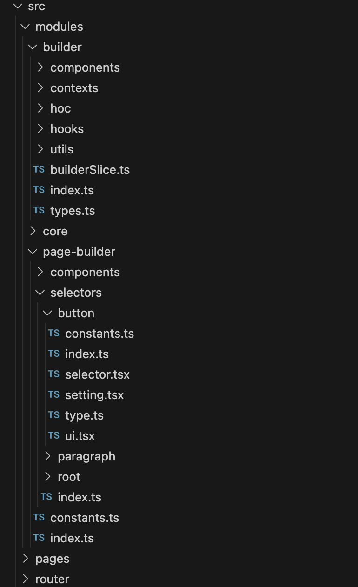

# Table of Contents

1. [Architecture](#Architecture)
2. [Setup](#Setup)
3. [Result](#Result)

## Architecture

User component - PBComponent (Node):

- Data structure:
  - id: generated randomly
  - tag: key to map component to render in builder/consumer
  - props: store value of props user customize
  - related: Map of components sharing current node context: use for rendering setting component
- Coding: Each component needs 2 basic file
  - ui: UI of component
  - selector: wrap UI component with some logic (`withSelector`) to allow users to customize on Editor

1. Solution:

- Sharing data: Store page content and other related data in a GlobalStore (Redux). Detail

  - State
    - content: page content: Map of user component
    - selectedNode: current node user clicks on
  - Expose some functions
    - addNode: add component user drop to page content
    - updateContent: set props of component

- Editor:

  - Handle add new node to content: eventListener `dragstart, dragend`
  - Get & set value of node: common hook `useProp` to get value from global store & set value to it

- Render page content in Builder/Consumer: use a map of tag-components to start render from rootId (ROOT) in `BuilderComponent`

2. Project folder structure

- `modules`

  - `builder`: Core logic Dnd & interact with props of user component in Editor
    - `components`:
      - TiptapEditor for inline text editor of Paragraph component
    - InputConfig: common TextInput for setting props of component
  - `page-builder`:
    - `components`: components used for UI of Admin page
    - `selectors`: user components: button, paragraph - selector: connect UI & functions in Editor - ui: UI of component - constants: default value for component props - types: interface of component props

- `pages`: UI pages in web app
- ...

## Setup

Step 1: Install package: `yarn` 
Step 2: Start project: `yarn start`: Visit http://localhost:3000 to see result

## Result

Features

- Drag and Drop: Button, Paragraph
- Allow users to customize text, alert message of Button
- Allow users to edit inline content of Paragraph
- Save & preview content in consumer page

Video: https://screenapp.io/app/#/shared/1ff89467-036a-4b83-afa6-4ad842052d72
